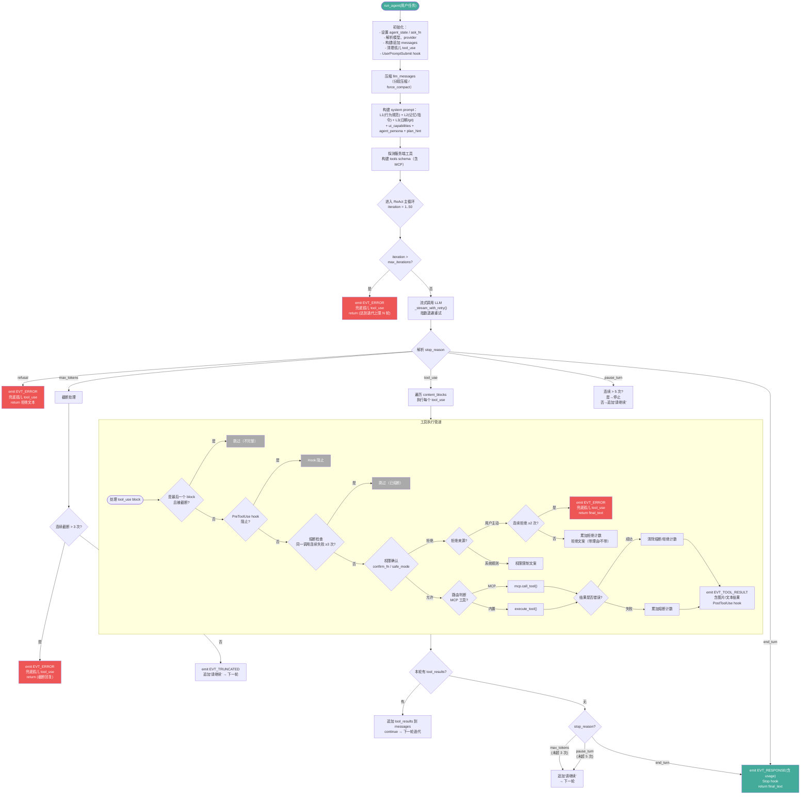

```mermaid
flowchart TD
    START(["run_agent(用户任务)"]) --> SETUP["初始化：\n- 设置 agent_state / ask_fn\n- 解析模型、provider\n- 构建/追加 messages\n- 清理孤儿 tool_use\n- UserPromptSubmit hook"]

    SETUP --> COMPRESS["压缩 llm_messages\n（分段压缩 / force_compact）"]

    COMPRESS --> BUILD_SYS["构建 system prompt：\nL1(行为规范) + L2(记忆/指令) + L3(日期/git)\n+ ui_capabilities + agent_persona + plan_hint"]

    BUILD_SYS --> PROBE["探测服务端工具\n构建 tools schema（含 MCP）"]

    PROBE --> LOOP_ENTER{"进入 ReAct 主循环\niteration = 1..50"}

    LOOP_ENTER --> CHECK_ITER{"iteration >\nmax_iterations?"}
    CHECK_ITER -->|"是"| ITER_LIMIT["emit EVT_ERROR\n兜底孤儿 tool_use\nreturn (达到迭代上限 N 轮)"]

    CHECK_ITER -->|"否"| CALL_LLM["流式调用 LLM\n_stream_with_retry()\n指数退避重试"]


    CALL_LLM --> PARSE_LLM{"解析 stop_reason"}

    PARSE_LLM -->|"refusal"| REFUSAL["emit EVT_ERROR\n兜底孤儿 tool_use\nreturn 拒绝文本"]

    PARSE_LLM -->|"max_tokens"| TRUNCATED["截断处理"]
    TRUNCATED --> CHECK_TRUNC{"连续截断 > 3 次?"}
    CHECK_TRUNC -->|"是"| TRUNC_STOP["emit EVT_ERROR\n兜底孤儿 tool_use\nreturn (截断回复)"]
    CHECK_TRUNC -->|"否"| TRUNC_CONT["emit EVT_TRUNCATED\n追加'请继续' → 下一轮"]

    PARSE_LLM -->|"tool_use"| EXEC_TOOLS["遍历 content_blocks\n执行每个 tool_use"]

    PARSE_LLM -->|"pause_turn"| PAUSE["连续 > 5 次?\n是→停止\n否→追加'请继续'"]

    PARSE_LLM -->|"end_turn"| FINAL["emit EVT_RESPONSE(含 usage)\nStop hook\nreturn final_text"]


    subgraph TOOL_PIPELINE ["工具执行管道"]
        T_START(["处理 tool_use block"])

        T_START --> T_TRUNC{"是最后一个 block\n且被截断?"}
        T_TRUNC -->|"是"| T_SKIP["跳过（不完整）"]
        T_TRUNC -->|"否"| T_HOOK{"PreToolUse hook\n阻止?"}
        T_HOOK -->|"是"| T_BLOCKED["Hook 阻止"]
        T_HOOK -->|"否"| T_BREAKER{"熔断检查\n同一调用连续失败 ≥3 次?"}
        T_BREAKER -->|"是"| T_FUSED["跳过（已熔断）"]
        T_BREAKER -->|"否"| T_CONFIRM{"权限确认\nconfirm_fn / safe_mode"}

        T_CONFIRM -->|"拒绝"| T_DENY{"拒绝来源?"}
        T_DENY -->|"用户主动"| T_DENY_USER{"连续拒绝 ≥2 次?"}
        T_DENY_USER -->|"是"| T_DENY_STOP["emit EVT_ERROR\n兜底孤儿 tool_use\nreturn final_text"]
        T_DENY_USER -->|"否"| T_DENIED["累加拒绝计数\n拒绝文案（带理由/不带）"]
        T_DENY -->|"系统规则"| T_SYS_DENY["权限限制文案"]

        T_CONFIRM -->|"允许"| T_EXEC{"路由判断\nMCP 工具?"}
        T_EXEC -->|"MCP"| T_MCP["mcp.call_tool()"]
        T_EXEC -->|"内置"| T_BUILTIN["execute_tool()"]

        T_MCP --> T_CHECK{"结果是否错误?"}
        T_BUILTIN --> T_CHECK
        T_CHECK -->|"失败"| T_FAILURE["累加熔断计数"]
        T_CHECK -->|"成功"| T_CLEAR["清除熔断/拒绝计数"]

        T_CLEAR --> T_RESULT["emit EVT_TOOL_RESULT\n含图片/文本结果\nPostToolUse hook"]
        T_FAILURE --> T_RESULT
    end


    EXEC_TOOLS --> TOOL_PIPELINE

    TOOL_PIPELINE --> T_COLLECT{"本轮有 tool_results?"}
    T_COLLECT -->|"有"| T_APPEND["追加 tool_results 到 messages\ncontinue → 下一轮迭代"]
    T_COLLECT -->|"无"| T_NEXT{"stop_reason?"}

    T_NEXT -->|"max_tokens\n(未超 3 次)"| T_CONTINUE["追加'请继续'\n→ 下一轮"]
    T_NEXT -->|"pause_turn\n(未超 5 次)"| T_CONTINUE
    T_NEXT -->|"end_turn"| FINAL


    style START fill:#4a9,color:#fff
    style FINAL fill:#4a9,color:#fff
    style ITER_LIMIT fill:#e55,color:#fff
    style REFUSAL fill:#e55,color:#fff
    style TRUNC_STOP fill:#e55,color:#fff
    style T_DENY_STOP fill:#e55,color:#fff
    style T_SKIP fill:#aaa,color:#fff
    style T_BLOCKED fill:#aaa,color:#fff
    style T_FUSED fill:#aaa,color:#fff
```
